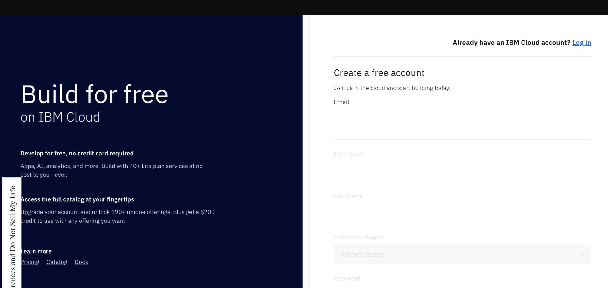
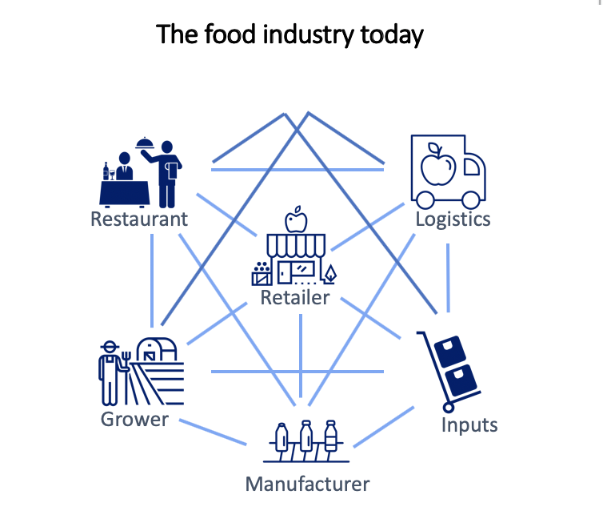
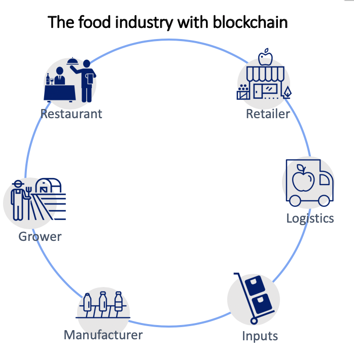
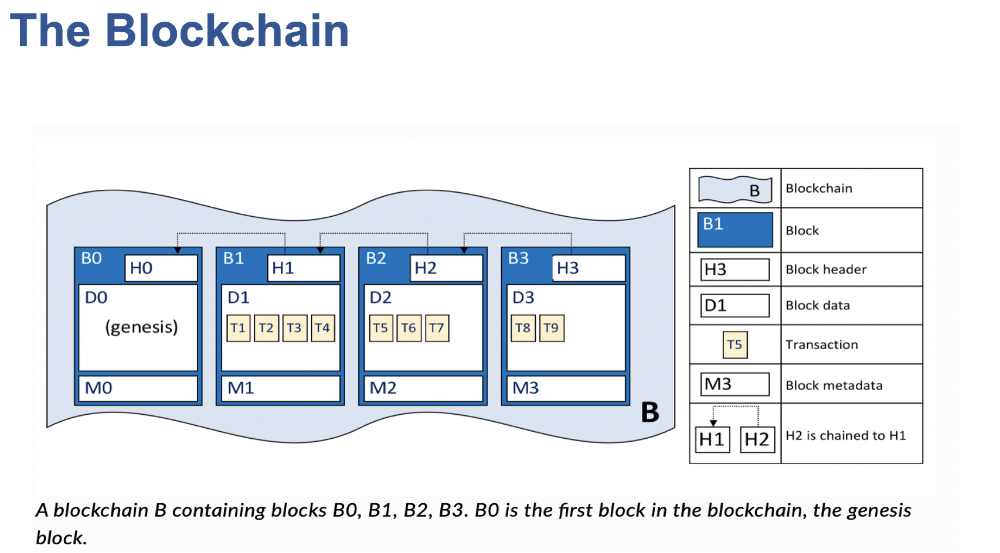
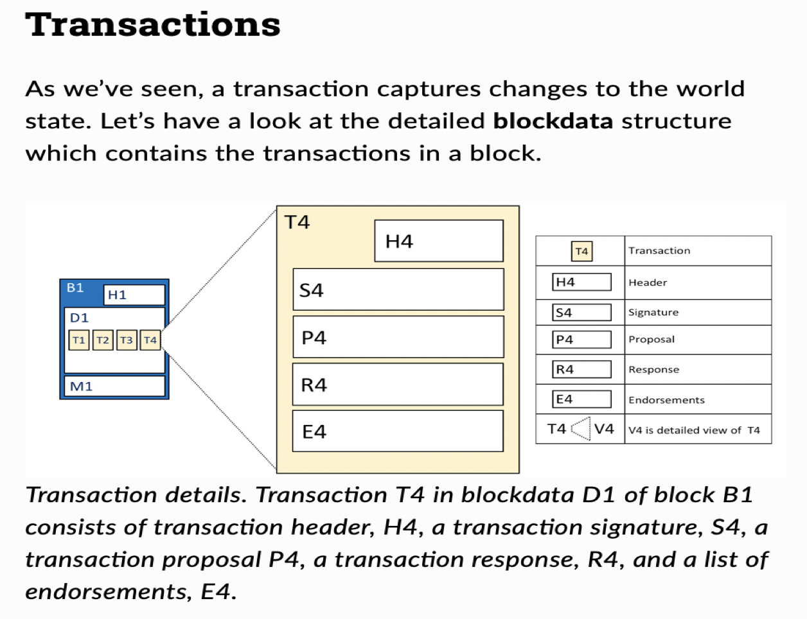
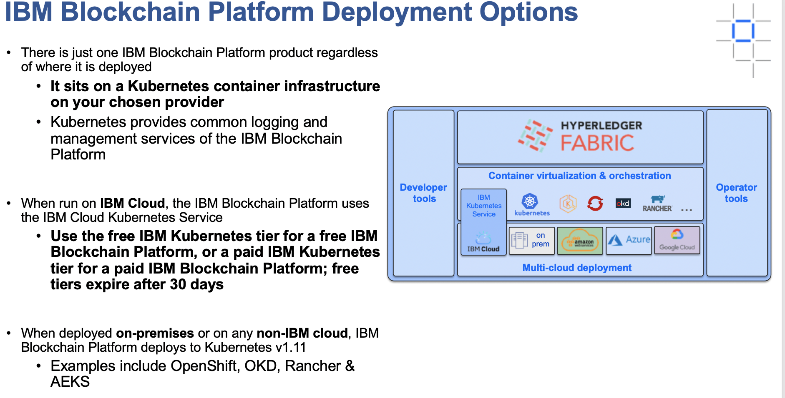
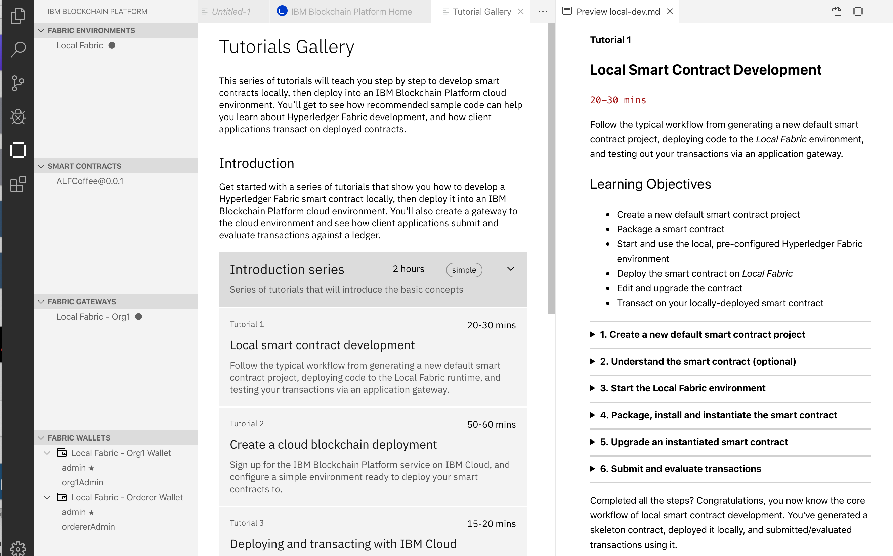
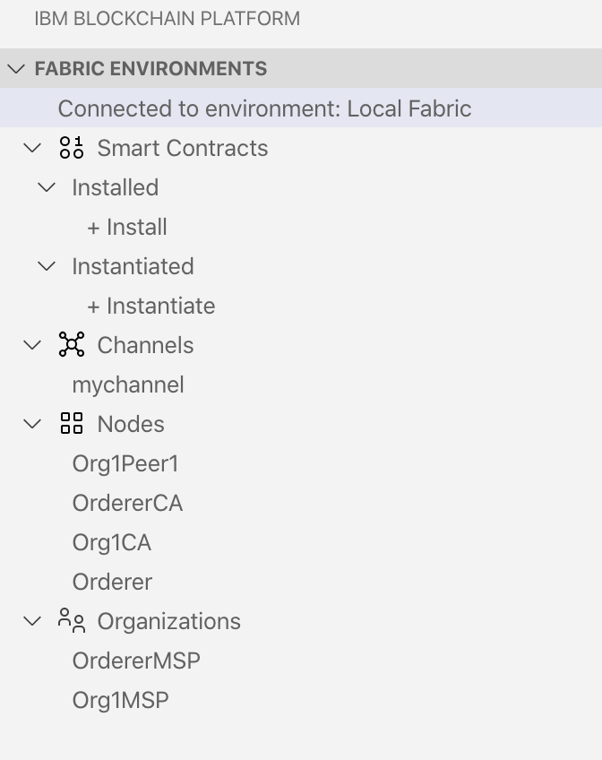

# URL to this repo: https://bit.ly/2PhVNrP

# How to Create a Supply Chain Blockchain App

#### Lennart Frantzell, IBM Devloper Advocate San Francisco alf@us.ibm.com

#### David Nugent, IBM Developer Advocate, San Francisco

#### Grant Steinfeld, IBM Developer Advocate New York City

## We'll start here: [Sign up to a free IBM Cloud Account](https://ibm.biz/BdqXL6)

### FYI: Satoshi Nakamoto's historik paper <i> "Bitcoin: A Peer-to-Peer Electronic Cash System" </i>  from Dec. 2008 https://bitcoin.org/bitcoin.pdf

## Hyperledger Fabric – from The Linux Foundation – is the modular blockchain framework that has become the de facto standard for enterprise blockchain platforms.

### FYI: [Hyperledger Fabric documentation](https://hyperledger-fabric.readthedocs.io/en/release-2.0/)

### FYI: [Hyperledger Fabric code](https://www.hyperledger.org/projects/fabric)

## In addition to the Hyperledger Fabric there is the cloud-based IBM Blockchain Platform:

### FYI: [IBM Blockchain Platform Component Overview](https://cloud.ibm.com/docs/services/blockchain?topic=blockchain-blockchain-component-overview)

### FYI: [Getting started with the IBM Blockchain Platform](https://cloud.ibm.com/docs/services/blockchain?topic=blockchain-get-started-ibp)

### FYI <a href="https://cloud.ibm.com/docs/services/blockchain?topic=blockchain-ibp-v2-faq#ibp-v2-faq-vscode-tutorials">IBM Blockchain Platform FAQs</a>

### FYI <a href="https://cloud.ibm.com/docs/services/blockchain?topic=blockchain-blockchain-component-overview">IBM Blockchain Platform Overview</a>

### [Blockchain Garage can help you get started with Blockchain](https://www.ibm.com/blockchain/garage)

## Food industry without Blockchain

 
## Food industry with Blockchain

================================================================================================

================================================================================================

# Some Supply Chain Apps

## <a href="https://www.ibm.com/blockchain/solutions/food-trust">IBM Food Trust</a>

## <a href="https://www.tradelens.com">Trade Lens</a>

## <a href="https://www.ibm.com/blockchain/industries/supply-chain">IBM Blockchain for Supply Chain </a>

## <a href="https://www.ibm.com/thought-leadership/blockchainbean/">Blockchain Bean</a>

# Developing Supply Chain Apps: pre-reqs

 1. [Pre-requisites 2.0](https://hyperledger-fabric.readthedocs.io/en/release-2.0/prereqs.html)
 2. Visual Studio Code: https://code.visualstudio.com. Sept 2019 version 1.39.x 
 3. Followed by the IBM Blockchain Platform Extension for VS Code: https://bit.ly/2RS2R02
 5. An account on the IBM Cloud: https://www.ibm.com/cloud
## 6. <a href="https://cloud.ibm.com/docs/services/blockchain/howto?topic=blockchain-develop-vscode">Developing smart contracts with Visual Studio Code extension </a>

<a href="https://github.com/IBMDeveloperNYC/coffee-supply-chain-blockchain"> Installing Visual Studio Code </a>

Download VS Studio code https://code.visualstudio.com/updates/v1_38

 
Pin VSCode Version!! Be sure to change Setttings/Update:Mode to manual
 
For this workshop you will need to confirm you have the Sept 2019 version 1.39.x of Visual Studio Code installed.

This extension supports the complete development workflow for Hyperledger Fabric and IBM Blockchain Platform:

https://github.com/IBMDeveloperNYC/coffee-supply-chain-blockchain/blob/master/TROUBLE-SHOOTING.md Trouble Shooting the VSCode installation

# Hands-on Blockchain

### IBM Blockchain 101: https://ibm.co/36U1QZM
 
### Blockchain code patterns: https://ibm.co/2GROsL0
  
### https://github.com/Grant-Steinfeld/coffee-supply-chain-blockchain

### Youtube Video: <a href="https://youtu.be/5b7awLi93-E">Create a simple Coffee Bean Supply Chain Blockchain on Hyperledger Fabric</a>

### <a href="https://developer.ibm.com/patterns/coffee-supply-chain-network-hyperledger-fabric-blockchain-2/">Create a fair trade supply chain network Use Hyperledger Fabric and IBM Blockchain Platform to increase efficiency in the supply chain of a coffee retailer></a>

Follow tutorials

### Tutorial 1 Local Smart Contract Development

Follow the typical workflow from generating a new default smart contract project, deploying code to the Local Fabric environment, and testing out your transactions via an application gateway.

1. CA = Certificate Authority

2. MSP = Membership Service Provider

### Tutorial 2

Create a cloud blockchain deployment

After developing a smart contract against the local runtime, you'll need somewhere more permanent to deploy for further dev, proof of concept, or production use. IBM Blockchain Platform includes an offering on IBM Cloud for creating and operating a suitable runtime environment for such purposes. Its full name is "IBM Blockchain Platform on IBM Cloud", but for the sake of brevity we'll refer to it from here on out as "the cloud service". In this tutorial you will learn how to get a cloud environment set up using the cloud service.

### Tutorial 3

Deploying and transacting with IBM Cloud

Important: You will need a smart contract package and a suitable cloud environment to follow this tutorial. Follow parts 1 and 2 of this series first for instructions.
               

