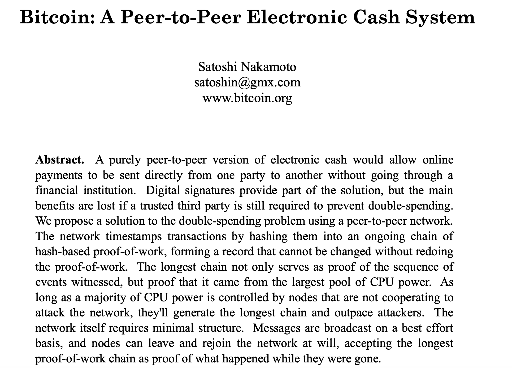

# https://bit.ly/2PhVNrP

# https://www.slideshare.net/LennartF

# How to Create a Supply Chain Blockchain App

## [Sign up to a free IBM Cloud Account](https://ibm.biz/BdqDWA)

## [Blockchain Platform in the IBM Cloud](https://cloud.ibm.com/catalog/services/blockchain-platform)

                                                           

  
  

===============================================================================================

===============================================================================================

===============================================================================================

================================================================================================

================================================================================================

================================================================================================

## You can also run Hyperledger Fabric natively in Kubernetes. Free for 30 days

## Hyperledger Fabric – from The Linux Foundation – is the modular blockchain framework that has become the de facto standard for enterprise blockchain platforms.

## [It offers a unique approach to consensus that enables performance at scale while also preserving the data privacy enterprises demand.](https://www.hyperledger.org/resources/publications/blockchain-performance-metrics)

## https://hyperledger-fabric.readthedocs.io/en/release-2.0/

## https://www.hyperledger.org/projects/fabric

## [Pre-requisites 2.0](https://hyperledger-fabric.readthedocs.io/en/release-2.0/prereqs.html)

# Development Tools

 1. Visual Studio Code: https://code.visualstudio.com
 2. Followed by the Visual Studio Platform plug-in: https://bit.ly/2RS2R02
 3. An account on the IBM Cloud: https://www.ibm.com/cloud
 4. Followed by the signing up to the IBM Blockchain Platform Service:   https://ibm.co/398sxeT
 5. VS Code Extension https://bit.ly/2RS2R02

 IBM Blockchain 101: https://ibm.co/36U1QZM
 
 Blockchain code patterns: https://ibm.co/2GROsL0
.  

Download VS Studio code https://code.visualstudio.com/updates/v1_38

This extension supports the complete development workflow for Hyperledger Fabric and IBM Blockchain Platform:

Follow tutorials

# Tutorial 1

Local Smart Contract Development

Follow the typical workflow from generating a new default smart contract project, deploying code to the Local Fabric environment, and testing out your transactions via an application gateway.

# Tutorial 2

Create a cloud blockchain deployment

After developing a smart contract against the local runtime, you'll need somewhere more permanent to deploy for further dev, proof of concept, or production use. IBM Blockchain Platform includes an offering on IBM Cloud for creating and operating a suitable runtime environment for such purposes. Its full name is "IBM Blockchain Platform on IBM Cloud", but for the sake of brevity we'll refer to it from here on out as "the cloud service". In this tutorial you will learn how to get a cloud environment set up using the cloud service.

# Tutorial 3

Deploying and transacting with IBM Cloud

Important: You will need a smart contract package and a suitable cloud environment to follow this tutorial. Follow parts 1 and 2 of this series first for instructions.
               
